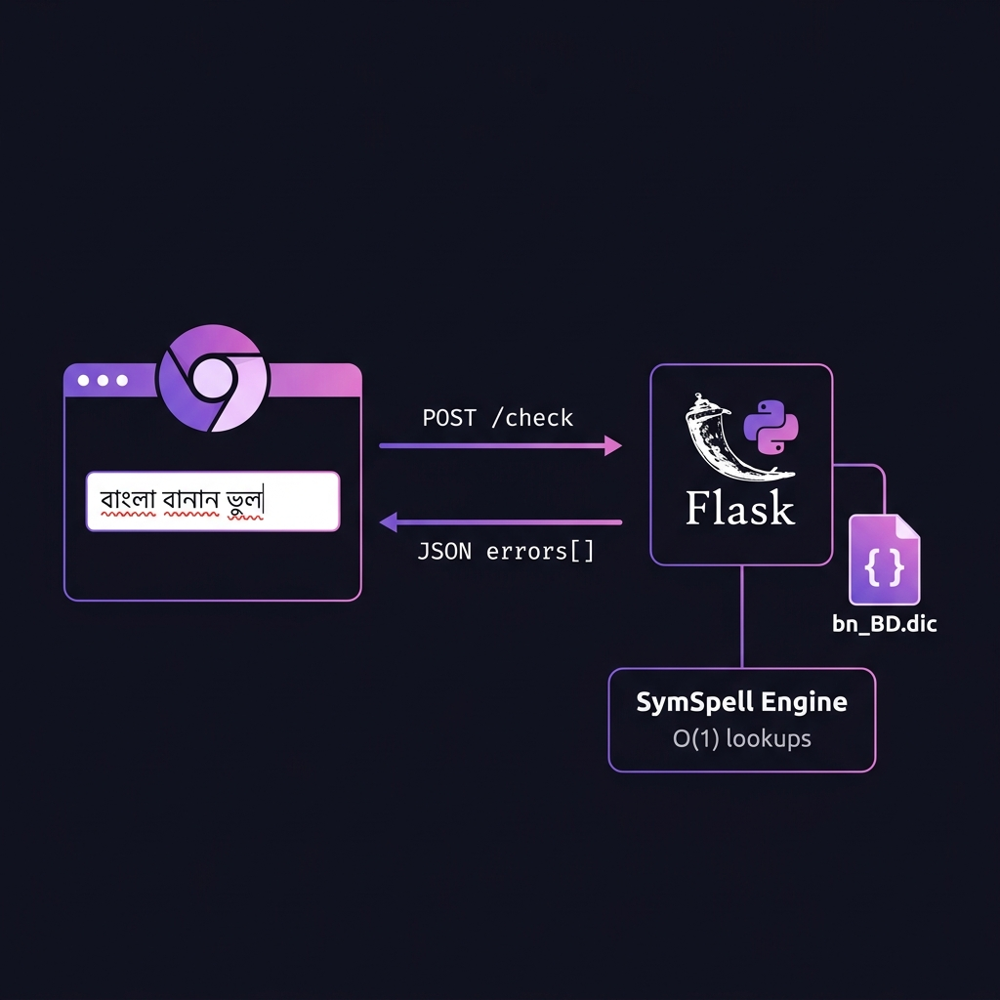

<p align="center">
  <h1 align="center">বাংলা বানান পরীক্ষক</h1>
  <p align="center"><strong>Real-Time Bengali Spellchecker — Chrome Extension</strong></p>
  <p align="center">
    
    
    
    
  </p>
</p>

---

A Grammarly-style Bengali spellchecker that runs as a Chrome extension. It highlights misspelled Bengali words with **red wavy underlines** in any text input on any website, and offers **click-to-replace suggestions** — all in real time.

> **Privacy first:** Your text never leaves your machine. The server runs 100% locally on `localhost`.



---

## Quick Start

```bash
# 1. Clone the repo
git clone https://github.com/Arifulmuntasir1/bangla-spellchecker.git
cd bangla-spellchecker

# 2. Install dependencies & start the server
cd server
pip install -r requirements.txt
python app.py

# 3. Load the extension in Chrome
#    → Open chrome://extensions
#    → Enable "Developer mode"
#    → Click "Load unpacked" → select the extension/ folder

# 4. Open any website, type Bengali — misspelled words get red underlines!
```

---

## Table of Contents

- [Quick Start](#quick-start)
- [Features](#features)
- [How It Works](#how-it-works)
- [Architecture](#architecture)
- [Project Structure](#project-structure)
- [Installation & Setup](#installation--setup)
- [How to Use](#how-to-use)
- [API Reference](#api-reference)
- [Technical Deep Dive](#technical-deep-dive)
- [Configuration](#configuration)
- [Troubleshooting](#troubleshooting)
- [Limitations & Known Issues](#limitations--known-issues)
- [Contributing](#contributing)
- [Acknowledgements & Credits](#acknowledgements--credits)
- [License](#license)

---

## Features

| Feature | Description |
|---------|-------------|
| 🔴 **Red Wavy Underlines** | Misspelled Bengali words are highlighted with red wavy underlines, just like Grammarly or MS Word |
| 💬 **Suggestion Tooltip** | Click any underlined word to see up to 5 correction suggestions in a dark-themed popup |
| ✏️ **Click-to-Replace** | Click a suggestion to instantly replace the misspelled word — works in both textareas and rich text editors |
| ⚡ **Real-Time** | Spellchecking happens in real-time with 500ms debouncing — no need to manually trigger a check |
| 🌐 **Works Everywhere** | Automatically detects `<textarea>` and `contenteditable` elements on every website |
| 📖 **110,750 Words** | Powered by the comprehensive `bn_BD.dic` Bengali dictionary |
| 🔍 **Fuzzy Matching** | Uses SymSpell (Symmetric Delete algorithm) for fast fuzzy matching up to edit distance 2 |
| 🧠 **Smart Ranking** | Multi-heuristic suggestion ranking with Bengali consonant skeleton matching — correct word is almost always in top 5 |
| 🖱️ **Cursor Preservation** | Your cursor position is never disturbed when highlights are applied |
| 🔄 **Dynamic Element Detection** | Automatically picks up dynamically-added text inputs (SPAs, lazy-loaded UI) via MutationObserver |

---

## How It Works

### The Big Picture

```
┌─────────────────────────────────────────────────────────┐
│                    CHROME BROWSER                        │
│                                                         │
│  ┌─────────────────────────────────────────────┐       │
│  │          Any Website (any tab)               │       │
│  │                                              │       │
│  │  ┌──────────────────────────┐               │       │
│  │  │  <textarea> or           │               │       │
│  │  │  [contenteditable]       │    input       │       │
│  │  │                          │──────event────►│       │
│  │  │  আমব বংলায লখছ ভূল     │               │       │
│  │  │  ~~~~  ~~~~~  ~~~        │               │       │
│  │  └──────────────────────────┘               │       │
│  │              ▲                               │       │
│  │              │ highlight                     │       │
│  │              │ errors                        │       │
│  │  ┌───────────┴──────────────┐               │       │
│  │  │   Content Script          │               │       │
│  │  │   (content.js)            │               │       │
│  │  │                           │               │       │
│  │  │  • Debounce (500ms)       │               │       │
│  │  │  • Fetch errors from API  │               │       │
│  │  │  • Render underlines      │               │       │
│  │  │  • Show tooltip           │               │       │
│  │  └───────────┬──────────────┘               │       │
│  └──────────────┼──────────────────────────────┘       │
│                 │                                       │
│          POST /check                                    │
│          {"text": "..."}                                │
│                 │                                       │
└─────────────────┼───────────────────────────────────────┘
                  │
                  ▼
┌─────────────────────────────────────────────────────────┐
│              PYTHON FLASK SERVER (localhost:5111)         │
│                                                          │
│  ┌──────────────────┐    ┌────────────────────────┐     │
│  │  POST /check      │    │  bn_BD.dic             │     │
│  │  • Tokenize text  │◄───│  (110,750 words)       │     │
│  │  • Lookup each    │    └────────────────────────┘     │
│  │    word in         │                                   │
│  │    SymSpell        │    ┌────────────────────────┐     │
│  │  • Return errors   │───►│  SymSpell Engine        │     │
│  │    with            │    │  • O(1) exact lookup    │     │
│  │    suggestions     │    │  • Edit distance ≤ 2    │     │
│  └──────────────────┘    │  • Damerau-Levenshtein  │     │
│                           └────────────────────────┘     │
│                                                          │
│  Response: {"errors": [{"word": "আমব", "start": 0,     │
│             "end": 3, "suggestions": ["আমল","আমি"]}]}   │
└─────────────────────────────────────────────────────────┘
```

### Step-by-Step Flow

1. **You type Bengali text** in any `<textarea>` or `contenteditable` field on any website.
2. **The content script detects the input event** and starts a 500ms debounce timer.
3. **After 500ms of no typing**, the script sends the full text to the local Flask server via `POST /check`.
4. **The server tokenizes** the text using a Bengali Unicode regex (`[\u0980-\u09FF]+`), extracting individual Bengali words.
5. **Each word is looked up** in the SymSpell engine (loaded from `bn_BD.dic`). If the best match has an edit distance > 0, the word is considered misspelled.
6. **The server returns** an array of errors, each containing the misspelled word, its position (start/end offsets), and up to 3 suggestions.
7. **The content script renders** red wavy underlines on the misspelled words:
   - For **textareas**: An invisible overlay `<div>` is placed on top (like Grammarly does)
   - For **contenteditable**: Misspelled words are wrapped in `<span class="bspell-error">` via DOM manipulation
8. **Click an underlined word** → a dark tooltip appears with suggestions.
9. **Click a suggestion** → the misspelled word is replaced instantly.

---

## Architecture

### Client-Server Model

This project uses a **client-server architecture** because:

- **Dictionary loading** is expensive (~110K words + SymSpell index) — doing it once on the server is efficient
- **SymSpell** is a Python library with no JavaScript equivalent of the same quality
- **The server runs locally** (`127.0.0.1:5111`) — your text never leaves your machine

### Two Highlighting Strategies

The extension uses different strategies for different input types:

#### Strategy A: Textarea Overlay (for `<textarea>`)

```
┌─────────────────────────────┐
│  Overlay <div>  (on top)    │ ◄── transparent text, red underlines only
│  আমব বংলায লখছ             │     pointer-events: none (clicks pass through)
│  ~~~~  ~~~~~  ~~~           │     except on error spans (pointer-events: auto)
├─────────────────────────────┤
│  Actual <textarea> (below)  │ ◄── fully interactive, untouched value
│  আমব বংলায লখছ             │     user types here normally
└─────────────────────────────┘
```

**Why this approach?** Modifying a textarea's `value` property would break undo/redo, caret position, and browser form state. The overlay approach leaves the textarea completely untouched.

#### Strategy B: TreeWalker DOM Manipulation (for `contenteditable`)

```
Before:  "আমব বংলায লখছ"  (single text node)
                ↓
After:   ""|<span class="bspell-error">আমব</span>" "|<span...>বংলায</span>" "| ..."
         (text nodes split at word boundaries, error words wrapped in spans)
```

**Caret preservation:** Before modifying the DOM, we walk all text nodes and compute the caret's absolute character offset. After modifications, we restore the caret to the same offset.

---

## Project Structure

```
Spell/
│
├── bn_BD.dic                    # Bengali dictionary (110,750 words)
├── README.md                    # This file
├── test_page.html               # Visual test page for development
│
├── docs/
│   └── architecture.png         # Architecture diagram
│
├── server/                      # Python Backend
│   ├── app.py                   # Flask API server (main entry point)
│   ├── requirements.txt         # Python dependencies
│   └── test_symspell.py         # CLI test script for dictionary lookups
│
└── extension/                   # Chrome Extension (Manifest V3)
    ├── manifest.json            # Extension manifest
    ├── content.js               # Content script (spellcheck logic, ~620 lines)
    └── styles.css               # Injected CSS (underlines + tooltip styling)
```

### File Details

| File | Lines | Purpose |
|------|-------|---------|
| `server/app.py` | 140 | Flask server — loads dictionary into SymSpell, exposes `/check` and `/health` endpoints |
| `extension/content.js` | 624 | Core spellcheck logic — textarea overlay, contenteditable highlighting, tooltip, debouncing |
| `extension/styles.css` | 63 | Red wavy underlines, dark-themed tooltip with hover effects and fade-in animation |
| `extension/manifest.json` | 20 | Manifest V3 config — declares content scripts and `localhost:5111` host permission |
| `bn_BD.dic` | 110,751 | Bengali dictionary — first line is word count, then one word per line |

---

## Installation & Setup

### Prerequisites

- **Python 3.10+** installed and in your PATH
- **Google Chrome** (or any Chromium-based browser)
- **pip** (Python package manager)

### Step 1: Clone the Repository

```bash
git clone https://github.com/Arifulmuntasir1/bangla-spellchecker.git
cd bangla-spellchecker
```

### Step 2: Install Python Dependencies

```bash
cd server
pip install -r requirements.txt
```

This installs:
| Package | Version | Purpose |
|---------|---------|---------|
| `flask` | 3.1.1 | Web server framework |
| `flask-cors` | 5.0.1 | Cross-Origin Resource Sharing (allows the extension to talk to localhost) |
| `symspellpy` | 6.9.0 | Fast fuzzy string matching using the Symmetric Delete algorithm |

### Step 3: Start the Server

```bash
python app.py
```

You should see:
```
[init] Loaded 110,750 words into SymSpell
[server] Bengali Spellchecker API running on http://localhost:5111
 * Running on http://127.0.0.1:5111
```

> **⚠️ Keep this terminal open!** The server must be running for the extension to work.

### Step 4: Load the Chrome Extension

1. Open Chrome and go to: `chrome://extensions`
2. Toggle **"Developer mode"** ON (top-right corner)
3. Click **"Load unpacked"**
4. Navigate to the project and select the `extension/` folder
5. The extension **"বাংলা বানান পরীক্ষক (Bengali Spellchecker)"** should appear in the list

### Step 5: Verify

Open `test_page.html` from the project root in Chrome. The status bar at the bottom should show **"Online (110,750 words)"**. Type misspelled Bengali text — red wavy underlines should appear after ~500ms.

---

## How to Use

### Everyday Workflow

1. **Start the server** — open a terminal and run `python app.py` inside the `server/` folder. You need to do this each time before using the extension.
2. **Open any website** — Gmail, Facebook, Notion, any blog comment box, or any site with text fields.
3. **Type in Bengali** — the spellchecker activates automatically when it detects Bengali characters.
4. **Wait ~500ms** after you stop typing — misspelled words get **red wavy underlines**.
5. **Click an underlined word** — a dark tooltip pops up with up to **5 correction suggestions**.
6. **Click a suggestion** — the misspelled word is **instantly replaced** with the correct spelling.

### Suggestion Tooltip

When you click a misspelled word, a tooltip appears:

```
 ┌──────────────────────────────┐
 │  ✗  "ভূল"                   │  ◄── Misspelled word (red)
 ├──────────────────────────────┤
 │  ভাল                        │  ◄── Click any row to replace
 │  ভিল                        │
 │  ভীল                        │
 │  ভুল  ✓                     │  ◄── The correct spelling
 │  ভোল                        │
 └──────────────────────────────┘
```

If no suggestions are available, it shows: **"কোনো পরামর্শ নেই"** (No suggestions available).

### Where It Works

| Element Type | Supported | How |
|-------------|-----------|-----|
| `<textarea>` | ✅ | Transparent overlay with red underlines |
| `<div contenteditable="true">` | ✅ | DOM-level word wrapping |
| Rich text editors (TinyMCE, CKEditor, etc.) | ✅ | They use contenteditable internally |
| `<input type="text">` | ❌ | Single-line inputs are excluded by design |
| Google Docs | ⚠️ Limited | Uses canvas rendering, content script can't access the text DOM |

### Keyboard Shortcuts

| Key | Action |
|-----|--------|
| `Escape` | Close the suggestion tooltip |
| Scroll | Auto-closes the tooltip |

---

## API Reference

The Flask server exposes two endpoints:

### `POST /check`

Checks Bengali text for spelling errors.

**Request:**
```json
{
  "text": "আমব বংলায লখছ তবে এখানে ভূল আছে"
}
```

**Response:**
```json
{
  "errors": [
    {
      "word": "আমব",
      "start": 0,
      "end": 3,
      "suggestions": ["কমব", "জমব", "দমব"]
    },
    {
      "word": "বংলায",
      "start": 4,
      "end": 9,
      "suggestions": ["বাংলা", "জংলা", "সংলাপ"]
    },
    {
      "word": "লখছ",
      "start": 10,
      "end": 13,
      "suggestions": ["লিখছ", "বখছ", "লড়ছ"]
    }
  ]
}
```

**Fields:**

| Field | Type | Description |
|-------|------|-------------|
| `word` | string | The misspelled word |
| `start` | int | Start character index in the original text |
| `end` | int | End character index (exclusive) |
| `suggestions` | string[] | Up to 3 closest correct words (by edit distance) |

### `GET /health`

Simple health check.

**Response:**
```json
{
  "status": "ok",
  "dictionary_size": 110750
}
```

---

## Technical Deep Dive

### SymSpell: Why Not Hunspell?

| Feature | SymSpell | Hunspell |
|---------|----------|----------|
| Lookup speed | **O(1)** average | O(n) worst case |
| Suggestion speed | ~microseconds | ~milliseconds |
| Memory usage | Higher (precomputed deletes) | Lower |
| Affix support | ❌ No | ✅ Yes |
| Algorithm | Symmetric Delete | Affix compression + ngrams |

We chose **SymSpell** because:
- **Speed**: O(1) lookups via precomputed delete combinations — critical for real-time checking
- **Simplicity**: No `.aff` (affix) file needed — just the word list
- **Edit distance**: Uses Damerau-Levenshtein distance (handles transpositions)

**Trade-off**: SymSpell doesn't understand Bengali morphology (suffixes like -তে, -য়, -র). A word like "বাংলায়" (correct inflected form) may be flagged if only "বাংলা" is in the dictionary.

### Debouncing Strategy

```
User types:  আ . ম . ব .   . ব . ং . ল . া . য .
             ↓   ↓   ↓       ↓   ↓   ↓   ↓   ↓   ↓
Timer:      [start]→[reset]→[reset]→[reset]→[reset]→ ... → [FIRE after 500ms idle]
                                                              ↓
                                                         API call sent
```

Each keystroke resets the 500ms timer. The API call only fires after the user pauses typing for 500ms. This prevents flooding the server with requests on every keystroke.

### The `/g` Regex Gotcha (Fixed)

JavaScript regexes with the `/g` flag maintain internal state (`lastIndex`):

```javascript
const re = /[a-z]+/g;
re.test("hello");  // true  (lastIndex = 5)
re.test("hello");  // false (starts from index 5, finds nothing!)
re.test("hello");  // true  (lastIndex reset to 0)
```

Our original code had `BENGALI_RE = /[\u0980-\u09FF]+/g` and used `.test()` to check if Bengali text exists — this caused the spellchecker to silently **skip every other check**. Fixed by using a non-`/g` regex for `.test()` calls.

### Smart Suggestion Ranking

SymSpell returns suggestions in **arbitrary order** when all dictionary words have the same frequency (which is our case — we assign `freq=1` to every word). This means the correct word is often buried far down the list.

We solve this with a **multi-heuristic scoring system** that re-ranks all suggestions:

| Heuristic | Weight | Purpose |
|-----------|--------|--------|
| Edit distance | -10.0 | Primary factor — fewer edits = better |
| Consonant skeleton match | +12.0 | If consonants (ক-হ) are identical, it's likely just a vowel-sign typo |
| Single-char substitution | +8.0 | Same-length words differing by 1 character (e.g. ূ→ু) |
| Positional match ratio | +5.0 | Percentage of characters matching at the same position |
| Longest common prefix | +3.0 | First-consonant match is critical in Bengali |
| Longest common suffix | +1.5 | Shared suffix = likely same inflection |
| Character set overlap | +2.0 | Jaccard similarity of character sets |
| Bigram overlap | +2.0 | Dice coefficient of character pairs |
| Length similarity | +1.5 | Same-length words are preferred |

**Example — before vs after ranking:**

| Misspelled | OLD Top 3 (raw SymSpell) | NEW Top 5 (ranked) |
|------------|--------------------------|---------------------|
| ভূল | ভূতল, কূল, তূল ❌ | ভাল, ভিল, ভীল, **ভুল**, ভোল ✅ |
| মানুশ | মানুক, মানুন, মানুষ | মানুন, মানুক, **মানুষ**, মানাই, মানাও ✅ |
| শীক্ষা | দীক্ষা, শিক্ষা | **শিক্ষা**, দীক্ষা, অশিক্ষা, শিক্ষক, শিক্ষণ ✅ |
| বাংলাদেস | বাংলাদেশ | **বাংলাদেশ** ✅ |

### Content Script Injection

The content script is injected into every page via `manifest.json`:

```json
"content_scripts": [{
  "matches": ["<all_urls>"],
  "js": ["content.js"],
  "css": ["styles.css"],
  "run_at": "document_idle"
}]
```

- `"<all_urls>"` — runs on every page
- `"document_idle"` — injected after the page is fully loaded (doesn't block rendering)
- A `MutationObserver` watches for dynamically-added text inputs (for SPAs)

---

## Configuration

### Server Configuration

Edit constants in `server/app.py`:

| Constant | Default | Description |
|----------|---------|-------------|
| `SERVER_PORT` | `5111` | Port the Flask server listens on |
| `MAX_EDIT_DISTANCE` | `2` | Maximum Damerau-Levenshtein distance for suggestions. Higher = more suggestions but slower |
| `SUGGESTION_COUNT` | `5` | Number of suggestions returned per misspelled word |
| `DICTIONARY_PATH` | `../bn_BD.dic` | Path to the dictionary file |

### Extension Configuration

Edit constants in `extension/content.js`:

| Constant | Default | Description |
|----------|---------|-------------|
| `API_URL` | `http://127.0.0.1:5111/check` | Server endpoint (must match `SERVER_PORT`) |
| `DEBOUNCE_MS` | `500` | Milliseconds to wait after typing before checking |

> **If you change the port**, update it in both `app.py` and `content.js`, and also in `manifest.json` under `host_permissions`.

---

## Troubleshooting

### "Server unreachable" in console

```
[BSpell] Server unreachable: Failed to fetch
```

**Fix:** Make sure the Python server is running:
```bash
cd server
python app.py
```

### No underlines appear

1. **Check the server** is running (`http://127.0.0.1:5111/health` should return JSON)
2. **Check the extension** is enabled in `chrome://extensions`
3. **Check the console** for errors (F12 → Console tab → look for `[BSpell]` messages)
4. **Refresh the page** after loading/reloading the extension
5. **Type Bengali text** (the checker ignores non-Bengali characters)

### Extension not showing in Chrome

- Make sure you loaded the `extension/` folder, **not** the root `Spell/` folder
- Make sure `manifest.json` exists inside the folder you selected

### False positives (correct words marked as errors)

The dictionary may not contain all inflected forms of Bengali words. For example:
- "বাংলায়" (inflected) may be flagged even though "বাংলা" (root) is in the dictionary
- This is a known limitation of dictionary-based (non-morphological) checkers

### Unicode errors in terminal

On Windows, the terminal may not display Bengali text. Set the encoding:
```powershell
$env:PYTHONIOENCODING = "utf-8"
python app.py
```

---

## Limitations & Known Issues

| Limitation | Explanation |
|-----------|-------------|
| **No morphological analysis** | SymSpell treats each word as-is — it doesn't understand Bengali suffixes, prefixes, or verb conjugations |
| **No grammar checking** | This is a spellchecker, not a grammar checker — it won't catch grammatically incorrect but correctly-spelled words |
| **Single-line `<input>` not supported** | By design, to avoid interfering with search bars, URL fields, etc. |
| **Google Docs** | Uses canvas-based rendering, so the content script can't access the text DOM |
| **Server must run locally** | The Flask server must be running for the extension to work — there's no offline mode |
| **No frequency data** | All dictionary words have equal frequency (1). We mitigate this with a multi-heuristic ranking system, but truly frequency-aware ranking would further improve suggestion order |
| **Edit distance 2 limit** | Words that differ by more than 2 edits from any dictionary word will get no suggestions |

---

## Contributing

### Adding Words to the Dictionary

Edit `bn_BD.dic`:
1. The first line is the word count — update it
2. Add one word per line (UTF-8 encoded)
3. Restart the server

### Testing

Run the CLI test:
```bash
cd server
python test_symspell.py
```

Or use the API directly:
```powershell
$body = [System.Text.Encoding]::UTF8.GetBytes('{"text": "আমব বংলায লখছ"}')
Invoke-WebRequest -Uri "http://127.0.0.1:5111/check" -Method Post -ContentType "application/json; charset=utf-8" -Body $body
```

---

## Acknowledgements & Credits

### 🙏 The Hunspell Bangla Project

Deep gratitude to the maintainers and open-source contributors behind the `bn_BD.dic` dictionary. Their tireless work in curating a highly accurate, foundational list of valid Bengali root words forms the bedrock of this tool's spelling accuracy. Without this painstakingly maintained lexicon of 110,750+ words, a project like this would not be possible.

### ⚡ SymSpell

Thanks to [Wolf Garbe](https://github.com/wolfgarbe/SymSpell) for creating the **Symmetric Delete spelling correction algorithm** — an ingenious approach that achieves O(1) lookup speed by precomputing delete combinations at index time. The Python port [`symspellpy`](https://github.com/mammothb/symspellpy) by mammothb made it effortless to integrate into this project.

### 👨‍💻 Developer

**Ariful Islam** — an amateur developer by hobby, building tools for the Bengali language community with the help of AI. This project was developed as a passion project to make Bengali writing more accessible and error-free across the web.

---

## License

This project is open source and available under the [MIT License](LICENSE).

---

<p align="center">
  <strong>Built with ❤️ for the Bengali language</strong><br>
  <sub>Ariful Islam • Flask • SymSpell • Chrome Manifest V3</sub>
</p>
